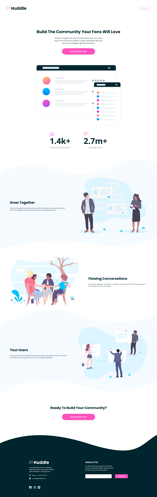

# Frontend Mentor - Huddle landing page with curved sections solution

This is a solution to the [Huddle landing page with curved sections challenge on Frontend Mentor](https://www.frontendmentor.io/challenges/huddle-landing-page-with-curved-sections-5ca5ecd01e82137ec91a50f2). Frontend Mentor challenges help you improve your coding skills by building realistic projects.

## Table of contents

- [Overview](#overview)
  - [The challenge](#the-challenge)
  - [Screenshot](#screenshot)
  - [Links](#links)
- [My process](#my-process)
  - [Built with](#built-with)
  - [What I learned](#what-i-learned)
- [Author](#author)

## Overview

### The challenge

Users should be able to:

- View the optimal layout for the site depending on their device's screen size
- See hover states for all interactive elements on the page

### Screenshot

### Links

- Solution URL: [Add solution URL here](https://your-solution-url.com)
- Live Site URL: [Add live site URL here](https://your-live-site-url.com)

## My process

### Built with

- Semantic HTML5 markup
- CSS custom properties
- Flexbox
- Mobile-first workflow

### What I learned

Curved sections look great! Learned a lot while working on this, and probably used flexbox more than I ever have before. I am unsure if I took the most optimal approach with creating the curved sections, as I know that there are many ways to set the images at the top and bottoms of the appropriate sections. It works though, and that was what I was going for. Will have to do more research for when I work with curve SVGs in the future.

Also proud of the little filtering trick I did on the footer logo svg to change it's color without changing the color of the same image in the header: `filter: brightness(0) invert(1);`
The above code makes the image black by setting its brightness to zero, then turns it white by means of inverting the color.

## Author

- Frontend Mentor - [@spencerrunde](https://www.frontendmentor.io/profile/spencerrunde)
