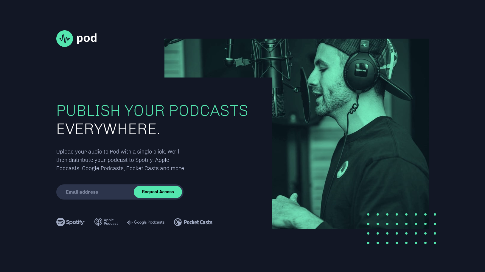

# Frontend Mentor - Pod request access landing page solution

This is a solution to the [Pod request access landing page challenge on Frontend Mentor](https://www.frontendmentor.io/challenges/pod-request-access-landing-page-eyTmdkLSG). Frontend Mentor challenges help you improve your coding skills by building realistic projects.

## Table of contents

- [Overview](#overview)
  - [The challenge](#the-challenge)
  - [Screenshot](#screenshot)
  - [Links](#links)
- [My process](#my-process)
  - [Built with](#built-with)
  - [What I learned](#what-i-learned)
- [Author](#author)

## Overview

### The challenge

Users should be able to:

- View the optimal layout depending on their device's screen size
- See hover states for interactive elements

### Screenshot

### Links

- Solution URL: [https://www.frontendmentor.io/solutions/mobilefirst-pod-landing-page-ySvwT1C7b](https://www.frontendmentor.io/solutions/mobilefirst-pod-landing-page-ySvwT1C7b)
- Live Site URL: [https://pod-landing-sr.netlify.app/](https://pod-landing-sr.netlify.app/)

## My process

### Built with

- Semantic HTML5 markup
- CSS custom properties
- Flexbox
- Mobile-first workflow
- Absolute positioning

### What I learned

For this project, I aimed for a much more "pixel-perfect" approach. Because of this, the desktop view doesn't look amazing on displays with bigger widths, as the design required the use of absolute positioning. On the specified design widths though, the website looks near perfect. Working with two media queries also took less time than I thought, as the design allowed for minor changes between screen sizes.

## Author

- Frontend Mentor - [@spencerrunde](https://www.frontendmentor.io/profile/spencerrunde)
