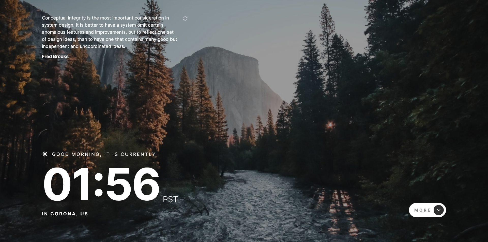

# Frontend Mentor - Clock app solution

This is a solution to the [Clock app challenge on Frontend Mentor](https://www.frontendmentor.io/challenges/clock-app-LMFaxFwrM). Frontend Mentor challenges help you improve your coding skills by building realistic projects.

## Table of contents

- [Overview](#overview)
  - [The challenge](#the-challenge)
  - [Screenshot](#screenshot)
  - [Links](#links)
- [My process](#my-process)
  - [Built with](#built-with)
  - [What I learned](#what-i-learned)
- [Author](#author)

## Overview

### The challenge

Users should be able to:

- View the optimal layout for the site depending on their device's screen size
- See hover states for all interactive elements on the page
- View the current time and location information based on their IP address
- View additional information about the date and time in the expanded state
- Be shown the correct greeting and background image based on the time of day they're visiting the site
- Generate random programming quotes by clicking the refresh icon near the quote

### Screenshot



### Links

- Solution URL: [https://www.frontendmentor.io/solutions/mobilefirst-react-clock-app-Fc0ZcjnsM](https://www.frontendmentor.io/solutions/mobilefirst-react-clock-app-Fc0ZcjnsM)
- Live Site URL: [https://react-clock-app-sr.netlify.app/](https://react-clock-app-sr.netlify.app/)

## My process

### Built with

- Semantic HTML5 markup
- CSS custom properties
- Flexbox
- CSS Grid
- Mobile-first workflow
- [React](https://reactjs.org/) - JS library

### What I learned

```html
<h1>Some HTML code I'm proud of</h1>
```

```css
.proud-of-this-css {
  color: papayawhip;
}
```

```js
const proudOfThisFunc = () => {
  console.log("🎉");
};
```

## Author

- Website - [Spencer Runde](https://spencerrunde.com/)
- Frontend Mentor - [@yourusername](https://www.frontendmentor.io/profile/yourusername)
