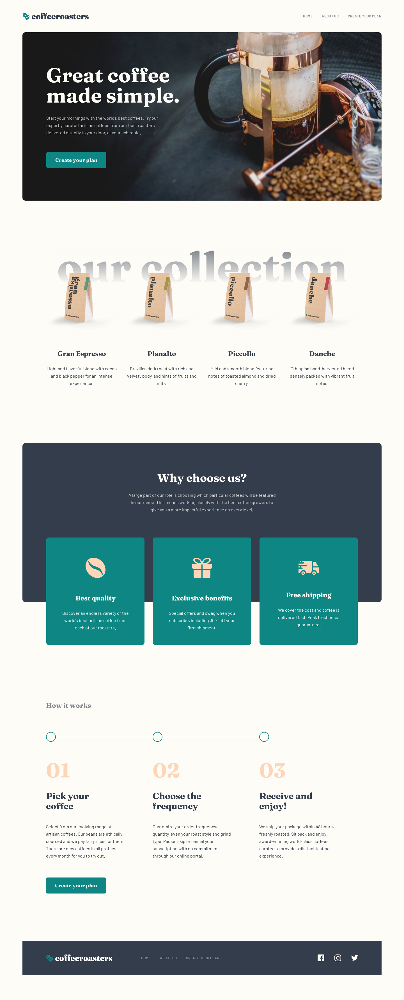

# Frontend Mentor - Coffeeroasters subscription site solution

This is a solution to the [Coffeeroasters subscription site challenge on Frontend Mentor](https://www.frontendmentor.io/challenges/coffeeroasters-subscription-site-5Fc26HVY6). Frontend Mentor challenges help you improve your coding skills by building realistic projects.

## Table of contents

- [Overview](#overview)
  - [The challenge](#the-challenge)
  - [Screenshot](#screenshot)
  - [Links](#links)
- [My process](#my-process)
  - [Built with](#built-with)
  - [What I learned](#what-i-learned)
- [Author](#author)

## Overview

### The challenge

Users should be able to:

- View the optimal layout for each page depending on their device's screen size
- See hover states for all interactive elements throughout the site
- Make selections to create a coffee subscription and see an order summary modal of their choices

### Screenshot



### Links

- Solution URL: [https://www.frontendmentor.io/solutions/mobilefirst-react-coffeeroasters-site-I4QQz2mkH](https://www.frontendmentor.io/solutions/mobilefirst-react-coffeeroasters-site-I4QQz2mkH)
- Live Site URL: [https://react-coffeeroasters-sr.netlify.app/](https://react-coffeeroasters-sr.netlify.app/)

## My process

### Built with

- Semantic HTML5 markup
- SCSS custom properties
- Flexbox
- Mobile-first workflow
- [React](https://reactjs.org/) - JS library

### What I learned

```js
{screenWidth >= 1440 && (
   <div className="desktop-nav__wrapper">
      <nav className="desktop-nav"> ...
```

I had to make use of conditional rendering quite a bit while working on the project. The mobile header and the desktop navbar for the subscribe page are two examples of this. This stands out as one of the features that makes React really great to me, along with stateful components of course. I'm sure that there is a more optimal way to go about creating the logic required for the subscribe page to work, and I will update it when I return to this project with more knowledge. Other than that, I am very happy with this project and the way that it turned out.

## Author

- Website - [Spencer Runde](https://spencerrunde.com/)
- Frontend Mentor - [@spencerrunde](https://www.frontendmentor.io/profile/spencerrunde)
