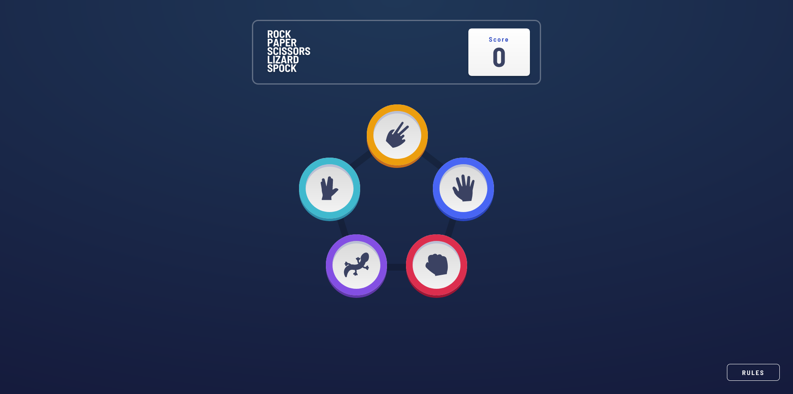

# Frontend Mentor - Rock, Paper, Scissors solution

This is a solution to the [Rock, Paper, Scissors challenge on Frontend Mentor](https://www.frontendmentor.io/challenges/rock-paper-scissors-game-pTgwgvgH). Frontend Mentor challenges help you improve your coding skills by building realistic projects.

## Table of contents

- [Overview](#overview)
  - [The challenge](#the-challenge)
  - [Screenshot](#screenshot)
  - [Links](#links)
- [My process](#my-process)
  - [Built with](#built-with)
  - [What I learned](#what-i-learned)
- [Author](#author)

## Overview

### The challenge

Users should be able to:

- View the optimal layout for the game depending on their device's screen size
- Play Rock, Paper, Scissors against the computer
- Maintain the state of the score after refreshing the browser _(optional)_
- **Bonus**: Play Rock, Paper, Scissors, Lizard, Spock against the computer _(optional)_

### Screenshot

### Links

- Solution URL: [https://www.frontendmentor.io/solutions/mobilefirst-rock-paper-scissors-lizard-spock-built-with-react-YydpUKXQr](https://www.frontendmentor.io/solutions/mobilefirst-rock-paper-scissors-lizard-spock-built-with-react-YydpUKXQr)
- Live Site URL: [https://react-rock-paper-scissors-sr.netlify.app/](https://react-rock-paper-scissors-sr.netlify.app/)

## My process

### Built with

- Semantic HTML5 markup
- SCSS custom properties
- Flexbox
- Mobile-first workflow
- [React](https://reactjs.org/) - JS library

### What I learned

This was my first time making use of routing with React. I specifically did this in order to work with BrowserRouter, and had the app switch between the play and game result pages. When it came to the rules popup modal I did some research. A common (unsure if best practice?) way of handling a modal is to render it to a seperate element outside of the root element, so this was the approach that I took.

## Author

- Website - [Spencer Runde](https://spencerrunde.com/)
- Frontend Mentor - [@spencerrunde](https://www.frontendmentor.io/profile/spencerrunde)
