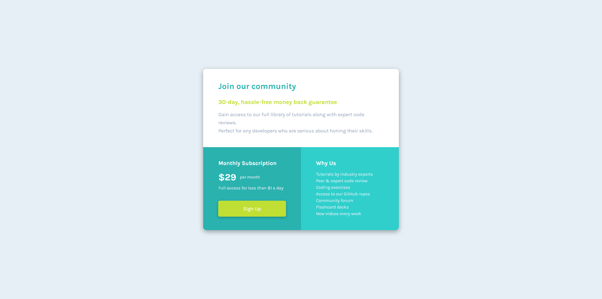

# Frontend Mentor - Single price grid component solution

This is a solution to the [Single price grid component challenge on Frontend Mentor](https://www.frontendmentor.io/challenges/single-price-grid-component-5ce41129d0ff452fec5abbbc). Frontend Mentor challenges help you improve your coding skills by building realistic projects. 

## Table of contents

- [Overview](#overview)
  - [The challenge](#the-challenge)
  - [Screenshot](#screenshot)
  - [Links](#links)
- [My process](#my-process)
  - [Built with](#built-with)
  - [What I learned](#what-i-learned)
- [Author](#author)


## Overview

### The challenge

Users should be able to:

- View the optimal layout for the component depending on their device's screen size
- See a hover state on desktop for the Sign Up call-to-action

### Screenshot



### Links

- Solution URL: [https://www.frontendmentor.io/solutions/single-price-grid-GRopjDvhf](https://www.frontendmentor.io/solutions/single-price-grid-GRopjDvhf)
- Live Site URL: [https://single-price-grid-sr.netlify.app/](https://single-price-grid-sr.netlify.app/)

## My process

### Built with

- Semantic HTML5 markup
- CSS custom properties
- CSS Grid
- Desktop-first workflow

### What I learned

This project marks the first time that I made use of CSS Grid. I built this project desktop-first as I wanted to focus on that. By using ```grid-template-areas```, I was able to define the "top" of the pricing grid as double the size of the bottom boxes. And then on mobile, all I had to do was set ```grid-template-columns``` to 100%, and redefine them all as equal.

## Author

- Frontend Mentor - [@spencerrunde](https://www.frontendmentor.io/profile/spencerrunde)
