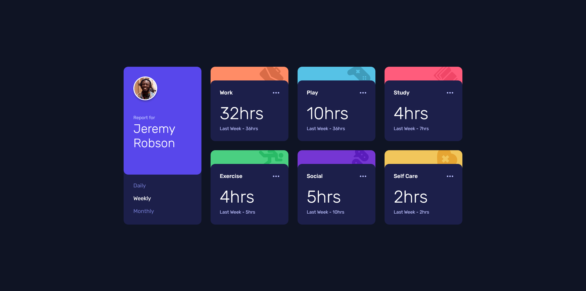

# Frontend Mentor - Time tracking dashboard solution

This is a solution to the [Time tracking dashboard challenge on Frontend Mentor](https://www.frontendmentor.io/challenges/time-tracking-dashboard-UIQ7167Jw). Frontend Mentor challenges help you improve your coding skills by building realistic projects.

## Table of contents

- [Overview](#overview)
  - [The challenge](#the-challenge)
  - [Screenshot](#screenshot)
  - [Links](#links)
- [My process](#my-process)
  - [Built with](#built-with)
  - [What I learned](#what-i-learned)
- [Author](#author)

## Overview

### The challenge

Users should be able to:

- View the optimal layout for the site depending on their device's screen size
- See hover states for all interactive elements on the page
- Switch between viewing Daily, Weekly, and Monthly stats

### Screenshot

### Links

- Solution URL: [https://www.frontendmentor.io/solutions/mobilefirst-time-tracking-dashboard-E5rbKyWHR](https://www.frontendmentor.io/solutions/mobilefirst-time-tracking-dashboard-E5rbKyWHR)
- Live Site URL: [https://time-tracking-dashboard-sr.netlify.app/](https://time-tracking-dashboard-sr.netlify.app/)

## My process

### Built with

- Semantic HTML5 markup
- CSS custom properties
- Flexbox
- CSS Grid
- Mobile-first workflow
- Vanilla JS

### What I learned

I learned to do some basic work with JSON data while completing this challenge. The JavaScript needed for this was actually fairly simple. Using `querySelectorAll` allows you to treat your HTML elements as an array, so I simply iterated over that array and replaced the `innerHTML` of each element with the cooresponding JSON data. I tried to make the JavaScript as small as possible, and I think I got close to achieving that, as it is only 57 lines of code.

## Author

- Frontend Mentor - [@spencerrunde](https://www.frontendmentor.io/profile/spencerrunde)
