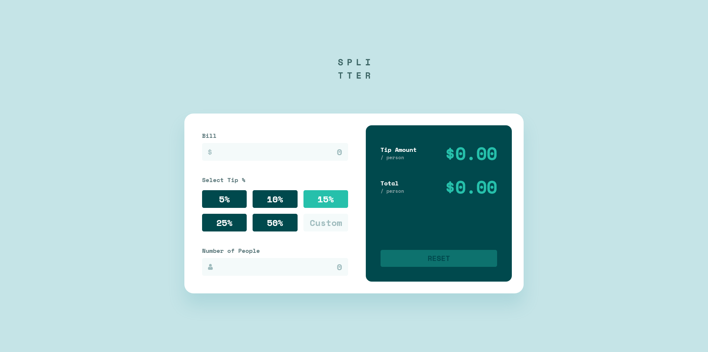

# Frontend Mentor - Tip calculator app solution

This is a solution to the [Tip calculator app challenge on Frontend Mentor](https://www.frontendmentor.io/challenges/tip-calculator-app-ugJNGbJUX). Frontend Mentor challenges help you improve your coding skills by building realistic projects.

## Table of contents

- [Overview](#overview)
  - [The challenge](#the-challenge)
  - [Screenshot](#screenshot)
  - [Links](#links)
- [My process](#my-process)
  - [Built with](#built-with)
  - [What I learned](#what-i-learned)
  - [Useful resources](#useful-resources)
- [Author](#author)

## Overview

### The challenge

Users should be able to:

- View the optimal layout for the app depending on their device's screen size
- See hover states for all interactive elements on the page
- Calculate the correct tip and total cost of the bill per person

### Screenshot

### Links

- Solution URL: [https://www.frontendmentor.io/solutions/mobilefirst-tip-calculator-app-L51Ux0z4Y](https://www.frontendmentor.io/solutions/mobilefirst-tip-calculator-app-L51Ux0z4Y)
- Live Site URL: [https://tip-calculator-sr.netlify.app/](https://tip-calculator-sr.netlify.app/)

## My process

### Built with

- Semantic HTML5 markup
- SCSS
- Flexbox
- CSS Grid
- Mobile-first workflow

### What I learned

Learned a lot about SCSS before and while I was working on this challenge. Before, I didn't exactly see the benefit of using SCSS, but now that I've used it myself, I am going to continue using it going forward. I like the way that variables are defined in SCSS more than vanilla CSS, and the ability to nest styles within each other is really nice to have. And of course, when you compile the SCSS into vanilla CSS, it automatically adds several browser specific styles for you, so it takes care of a lot of "chores" for you.

### Useful resources

- [https://www.youtube.com/watch?v=Zz6eOVaaelI](https://www.youtube.com/watch?v=Zz6eOVaaelI) - Big shoutouts to Dev Ed! I watched his short 20 minute video before taking on this project, took some notes, and I had everything I needed to know about SCSS.

## Author

- Frontend Mentor - [@spencerrunde](https://www.frontendmentor.io/profile/spencerrunde)
